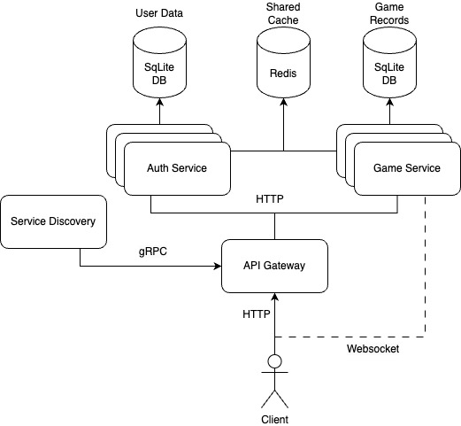

# Guess the Number Multiplayer Tournament

**Andreea Manole**  
**FAF-212, Distributed Systems Course**

## Application Suitability Assessment

Why is the "Guess the Number" Multiplayer Tournament a good candidate for microservices?

Think about the different parts of the game — player login, matchmaking, game rules, leaderboards — all these things have unique functions. Doesn’t it make sense to manage each one separately? Microservices allow me to build and update them individually without involving the entire system.

What happens when a tournament gets busy? Not all parts of the game will experience the same traffic. Matchmaking and game rules might need to handle way more requests. Microservices let those parts scale up to meet demand while others stay steady.

And what if you need to update the game? Wouldn’t it be easier if you could fix one part, like the login system, without affecting everything else? Microservices make this possible, allowing you to fix bugs, add features smoothly, without downtime.

### Real-World Examples

1. **Fortnite**

   - Fortnite uses microservices to handle matchmaking, game status, and player stats. This setup helps manage a large number of players and frequent updates smoothly.

2. **Minecraft**

   - Minecraft uses microservices to manage game worlds, player interactions, and server connections, making it easier to scale and maintain the game.

3. **PUBG**
   - PUBG uses microservices to handle matchmaking, player data, and game sessions, which helps manage the high demands of its players and real-time gameplay.

## Service Boundaries

### Architecture Diagram



### Service Definitions

1. **Authentication and Matchmaking Service (Service A)**

   - **Purpose**: Manages player authentication, matchmaking, room management, and player statistics.
   - **Technology Stack**: Python with Flask, SQLite, Redis.

2. **Game Logic and Leaderboard Service (Service B)**

   - **Purpose**: Handles core game mechanics, number generation, guess validation, scoring, and leaderboard management.
   - **Technology Stack**: Python with Flask, SQLite.

3. **API Gateway**
   - **Purpose**: Routes client requests to appropriate services.
   - **Technology Stack**: Node.js with Express Gateway.

## Technology Stack and Communication Patterns

### Service A (Authentication & Matchmaking)

- **Programming Language/Framework**: Python with Flask
- **Database**: SQLite
- **Caching**: Redis
- **Communication Pattern**: RESTful API

### Service B (Game Logic & Leaderboard)

- **Programming Language/Framework**: Python with Flask
- **Database**: SQLite
- **Caching**: Redis
- **Communication Pattern**: RESTful API, WebSocket for real-time multiplayer play

### API Gateway

- **Programming Language/Framework**: Node.js with Express Gateway
- **Communication Pattern**: Request routing

## Data Management

### Caching and Queues

Both Service A and Service B share a cache to quickly access player stats and room info. This keeps data consistent and speeds up responses.

Queues handle requests for creating rooms and matchmaking, preventing system overload and making the app run smoothly.

### Service A Endpoints

- **POST /register**
  - **Request**: `{ "username": "string", "password": "string" }`
  - **Response**: `{ "message": "User registered successfully" }`
- **POST /login**
  - **Request**: `{ "username": "string", "password": "string" }`
  - **Response**: `{ "token": "jwt-token" }`
- **POST /logout**
  - **Request**: `{ "token": "jwt-token" }`
  - **Response**: `{ "message": "User logged out successfully" }`
- **POST /matchmake**
  - **Request**: `{ "token": "jwt-token" }`
  - **Response**: `{ "roomId": "string", "role": "string" }`
- **GET /room-status**
  - **Request**: `{ "roomId": "string" }`
  - **Response**: `{ "status": "string", "players": [{ "playerId": "string", "role": "string" }] }`
- **POST /players/{playerId}/update-stats**
  - **Request**: `{ "points": "integer" }`
  - **Response**: `{ "message": "Player stats updated successfully" }`

### Service B Endpoints

- **join**: Player requests to join a game room.

  - **Request**:
    ```json
    {
      "type": "join",
      "payload": {
        "player_name": "Andreea",
        "room": "Room1"
      }
    }
    ```
  - **Response** (join_ack):
    ```json
    {
      "type": "join_ack",
      "payload": {
        "message": "Welcome Andreea to Room1!",
        "players": ["Andreea"]
      }
    }
    ```

- **send_number**: One player submits the secret number for the game.

  - **Request**:
    ```json
    {
      "type": "send_number",
      "payload": {
        "player_name": "Andreea",
        "room": "0000",
        "number": 42
      }
    }
    ```
  - **Response**:
    ```json
    {
      "type": "send_number_ack",
      "payload": {
        "message": "Number has been submitted."
      }
    }
    ```

- **guess_number**: Anoter player submits a guess.

  - **Request**:
    ```json
    {
      "type": "guess_number",
      "payload": {
        "player_name": "John",
        "room": "0000",
        "guess": 35
      }
    }
    ```

- **guess_response**: Server responds to the guess with feedback.

  - **Response**:
    ```json
    {
      "type": "guess_response",
      "payload": {
        "message": "Too low! Try again.",
        "correct": false,
        "hint": "higher"
      }
    }
    ```

- **disconnect**: Player disconnects from the room.

  - **Request**:
    ```json
    {
      "type": "disconnect",
      "payload": {
        "player_name": "Andreea",
        "room": "0000"
      }
    }
    ```

- **notification**: Server sends a message to all players about game events.
  - **Response**:
    ```json
    {
      "type": "notification",
      "payload": {
        "message": "Andreea has guessed the correct number!"
      }
    }
    ```

## Deployment and Scaling

### Deployment

- **Containers**: Docker to containerize services.
- **Orchestration**: Docker Compose for managing container services, to ensure load balancing, automatic scaling.

---

## Resources

1. [Monoliths vs. Microservices in Gaming Architecture](https://www.reddit.com/r/gamedev/comments/xdurgt/monoliths_vs_microservices_in_gaming_architecture/)
2. [Building a Microservices Example Game with Distributed Messaging](https://blog.risingstack.com/building-a-microservices-example-game-with-distributed-messaging/)
3. [Microservices Examples](https://blog.dreamfactory.com/microservices-examples)
4. [Docker Curriculum](https://docker-curriculum.com/)
5. [ELI5: What is Docker and How Do You Use It?](https://www.reddit.com/r/Frontend/comments/yvem0t/eli5_what_is_docker_and_how_do_you_use_it/)
6. [Distributed Game Architectures](http://www.dbs.ifi.lmu.de/cms/VO_Managing_Massive_Multiplayer_Online_Games)  
   [Chapter 3: Distributed Game Architectures (PDF)](https://www.dbs.ifi.lmu.de/Lehre/mmmo/sose17/slides/MMMO-3-Network.pdf)
